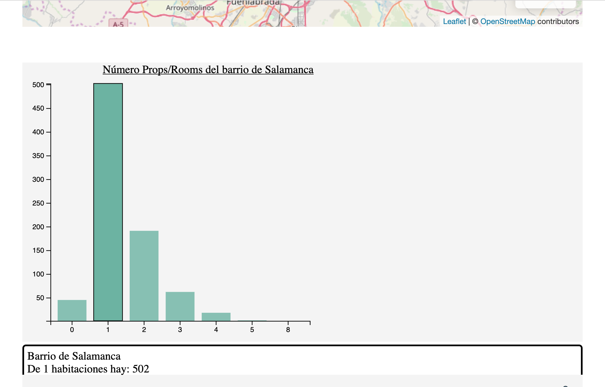

## Visualización de datos con D3 js

### Entrega de la práctica de D3 js

Los requisitos para esta práctica son:

A partir de los datos de nuestro fichero de airbnb:

* 	Crear un mapa con los barrios de la ciudad de Madrid y pintarlos por colores según el precio medio del alquiler en el barrio.
  
*  Crear una gráfica que en el eje Y tenga el número de propiedades y en el eje X el número de habitaciones de un barrio.
*  Crear una gráfica que dibuje una regresión lineal de alguna de las características con respecto al precio en un barrio.
*  Hacer que el valor de las gráficas cambien con los datos del barrio al que hago click en el mapa.

## Desarrollo de la práctica.
Hemos utilizado Visual Studio Code para el desarrollo de nuestro proyecto, Javascript y D3 js.

Hemos instalado el módulo de http-server en nuestro proyecto, para poder generar un servidor de páginas web y poder visualizar los resultados de nuestra práctica según vamos desarrollando.(http://localhost:8080/)

Para pintar nuestros barrios se ha utilizado como base de mapa la librería open-source de Leaflet (https://leafletjs.com/)

Los datos utilizados en el proyecto los hemos adjuntado al proyecto porque han sido adquiridos de fuentes externas. Para poder hacer un test serán necesarios. 

Existe el fichero de airbnb.csv con los datos de los alquileres vacacionales. Este fichero ha sido aprovechado de la práctica anterior.

Para el geoposicionamiento de los barrios, hemos utilizado un fichero decargado de internet con formato geojson llamado distritos.geojson.

## Ejecución de la práctica

### Punto uno

 En el punto número uno, en la creación del mapa con los barrios de Madrid, hemos dividido los barrios agrupandolos por el campo "Neighbourhood_Group_Cleansed" de nuestro fichero airbnb.csv y lo hemos fusionado con el fichero distritos.geojson, para obtener un dataset sólo con los campos necesarios, para poder representar nuestros datos en el mapa. Para la carga, fusión y cálculo de datos se ha utilizado únicamente la libreria de "D3".

En esta imagen podemos observar que los barrios están pintados según los precios medios de alquiler, aplicado una degradación de color para distinguir los precios más elevados de los menos. Los más caros tienen un color oscuro y este se aclara según bajamos de precio medio.

Hemos incluido una leyendo en la parte inferior derecha para mostrar la escala de precios y color.

Este mapa es totalmente interactivo

* 	Situándonos encima de un barrio, este queda remarcado y además nos aparece una leyenda en la parte superior derecha, que nos indica el nobre del barrio, el precio medio, la disponibilidad y las reviews.

* 	Haciendo click sobre un barrio, nos saldrá un alert, indicándonos las cooredenadas y el barrio a que pertenecen. También se nos actualizarán los datos de la gráfica que se mostrará a continuación.

### Punto dos y cuatro

En el segundo punto, crear una gráfica que en el eje Y tenga el número de propiedades y en el eje X el número de habitaciones de un barrio.

* En esta gráfica hemos incorporado un título que nos detalla lo que estamos visualizando y además nos indica de que barrio se están mostrando los datos, es totalmente dinámico.
* Los ejes de la gráfica, se ajustan a los datos a mostrar de cada barrio.
* También la hemos dotado de interactividad. Cuando nos situamos encima de una barra, esta cambia de color y queda remarcada. 
* Además nos muestra un tooltip en la parte inferior, detallando el Barrio, el número de habitaciones y la cantidad. Este tooltip, después de pelearme horas con él, ha quedado en la parte inferior, no he conseguido que saliera al lado de la barra correspondiente.
* Esta gráfica tiene uan carga inicial con los datos de barrio "Centro".
* Cumpliendo con el punto número 4, esta gráfica actualiza sus datos cuando interactuamos con el mapa que hemos visto anteriormente, haciendo un click sobre cualquiera de los barrios pintados.

### Punto tres

En desarrollo.

Los datos actuales son una base para empezar a trabajar.

### Imagen final de la práctica.

